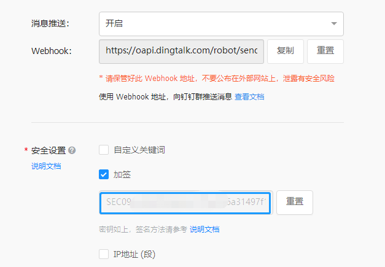
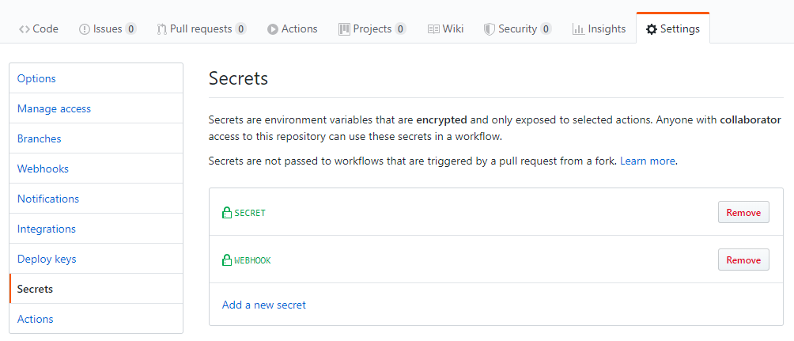
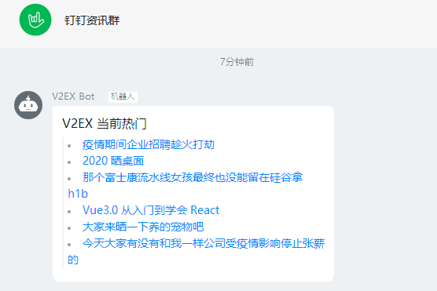
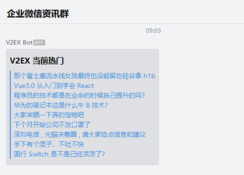

<p align="center">
  <a href="https://github.com/yanglbme/v2ex-action">
    
  </a>
</p>

<h1 align="center">V2EX Action</h1>

<div align="center">

[](https://github.com/yanglbme/v2ex-action/actions) [](https://github.com/yanglbme/v2ex-action/actions) [](../../releases) [](./LICENSE) [](../../pulls)

</div>

自动将 [V 站](https://v2ex.com)热门发送到指定的 webhook 地址，如企业微信群机器人。可配置 workflow 的触发条件为 `schedule`，实现周期性定时发送热门内容。欢迎 Star ⭐ 关注本项目。

V2EX Action 支持钉钉机器人、企业微信机器人两种 webhook。

## 入参

| 参数      | 描述         | 是否必传 | 默认值 |
| --------- | ------------ | -------- | ------ |
| `webhook` | Webhook 地址 | 是       | -      |
| `secret`  | 签名密钥     | 否       | ''     |
| `count`   | 帖子数量     | 否       | 8      |

若是钉钉，务必**提供签名密钥**，企业微信则无须提供。



## 完整示例

在你的任意一个 GitHub 仓库 `.github/workflows/` 文件夹下创建一个 .yml 文件，如 `v2ex.yml`，内容如下：

```yml
name: V2ex

on:
  schedule:
    # 可自定义 cron 表达式
    - cron: "0 2 * * *"

jobs:
  build:
    runs-on: ubuntu-latest
    steps:
      - uses: yanglbme/v2ex-action@main
        with:
          webhook: ${{ secrets.WEBHOOK }}
          secret: ${{ secrets.SECRET }}
          count: 6
```

注意：

- cron 是 UTC 时间，使用时请将北京时间转换为 UTC 进行配置。由于 GitHub Actions 的限制，如果将 cron 设置为 `* * * * *`，则实际的执行频率为每 5 分钟执行一次。

  ```bash
  ┌───────────── 分钟 (0 - 59)
  │ ┌───────────── 小时 (0 - 23)
  │ │ ┌───────────── 日 (1 - 31)
  │ │ │ ┌───────────── 月 (1 - 12 或 JAN-DEC)
  │ │ │ │ ┌───────────── 星期 (0 - 6 或 SUN-SAT)
  │ │ │ │ │
  │ │ │ │ │
  │ │ │ │ │
  * * * * *
  ```

- 请在项目的 `Settings -> Secrets` 路径下配置好 `WEBHOOK` 与 `SECRET`(仅钉钉机器人要配置)，不要直接在 `.yml` 文件中暴露地址跟密钥。

  

## 效果

<table>
  <tr>
    <td align="center" style="width: 400px;">
      <a href="https://ding-doc.dingtalk.com/doc#/serverapi3/iydd5h">
        <br>
        <sub>钉钉</sub>
      </a>
    </td>
    <td align="center" style="width: 400px;">
      <a href="https://work.weixin.qq.com/api/doc/90000/90136/91770">
        <br>
        <sub>企业微信</sub>
      </a>
    </td>
  </tr>
</table>

## 联系我

对于 V2EX Action 有任何的疑问，还可以通过以下方式找到我。

<table>
  <tr>
    <td align="center" style="width: 200px;">
      <a href="https://github.com/doocs">
        <br>
        <sub>公众平台</sub>
      </a><br>
    </td>
    <td align="center" style="width: 200px;">
      <a href="https://github.com/yanglbme">
        <br>
        <sub>个人微信</sub>
      </a><br>
    </td>
  </tr>
</table>

## 许可证

[MIT](LICENSE)
